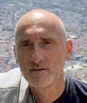

# Welcome to my page!

{align=right}

I am a senior data scientist at [Kelkoo](https://www.kelkoogroup.com) (France).
I used to be a data scientist/software engineer at
[ProbaYes](http://www.probayes.com/en) (France). I obtained a Ph. D. degree in
2006 from [Tohoku University](http://www.astro.mech.tohoku.ac.jp) (Japan) and a
M. Sc. diploma in 1999 from the [Technical
University-Sofia](http://fa.tu-sofia.bg) (Bulgaria). I have been a research
scientist at the [INRIA](http://www.inrialpes.fr/bipop/index.html) research
center near Grenoble (France), and at the
[AASS](http://www.aass.oru.se/Research/Learning/index.html) research center at
Örebro University (Sweden).

## Teaching

I was responsible for a number of [courses/seminars](http://www.aass.oru.se/Research/Learning/drdv.html)
during my 5 year stay at Örebro University.

## Software

Some of my hobby projects can be found on [github](https://github.com/drdv) and [bitbucket](https://bitbucket.org/drdv).

## Contact

- **email**: <mail.mitko@gmail.com>
