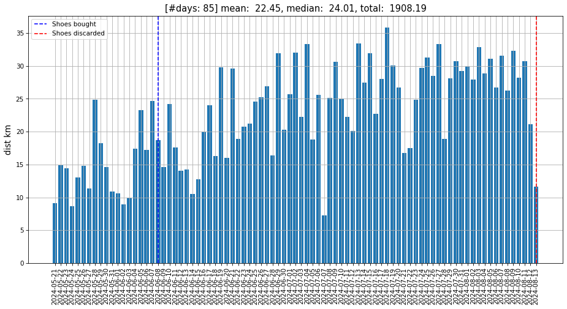
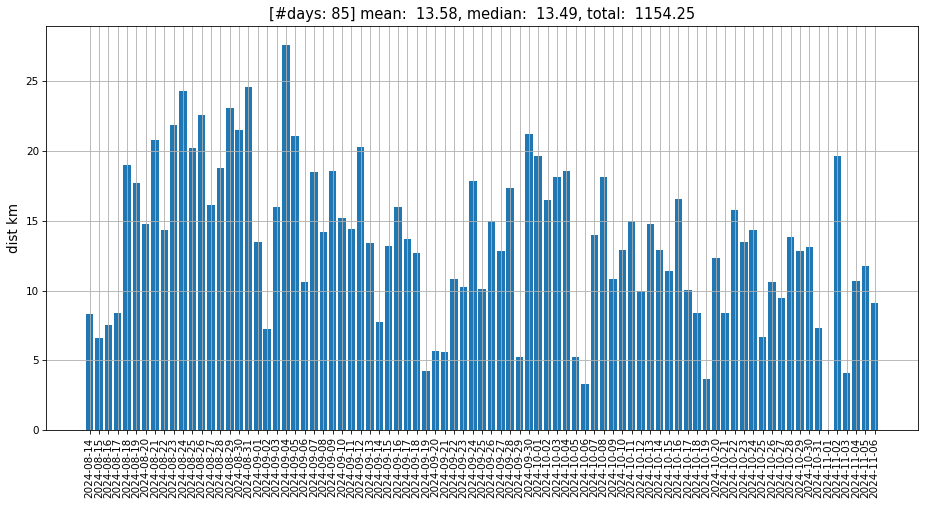
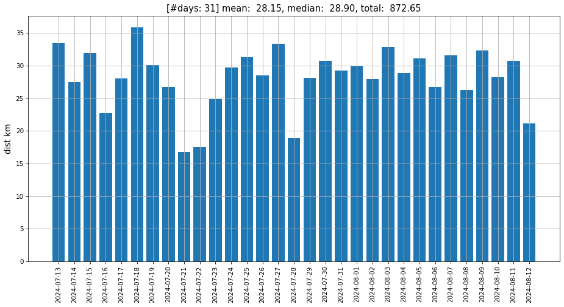
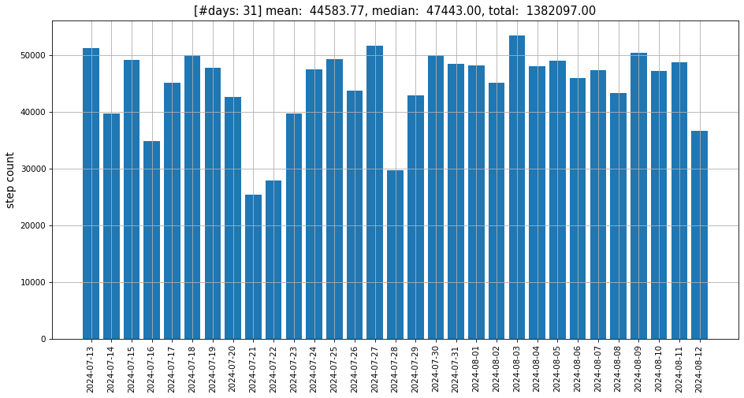
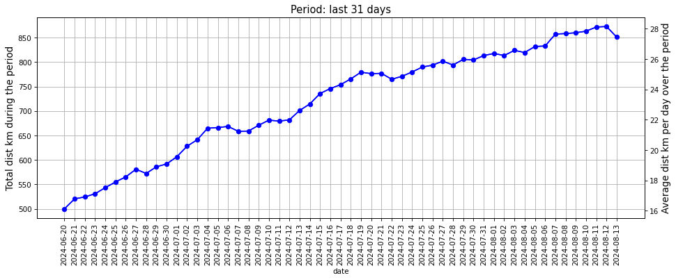
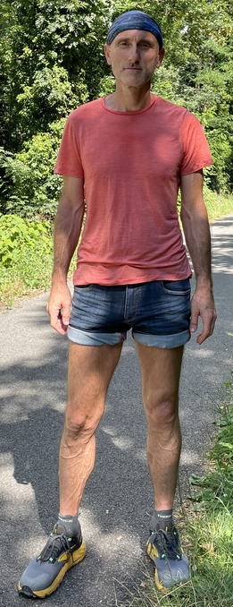

# Summer walking challenge

Walking has always been an important part of my routine. This summer I decided to
collect some data. Here are the results ...

<!-- more -->

/// figure-caption
Daily distance (entire challenge)
///

/// figure-caption
Daily distance (post-challenge)
///

/// figure-caption
Daily distance (last month of challenge)
///

/// figure-caption
Daily step count (last month of challenge)
///

## The challenge

On May 21st, I decided to consistently carry my phone with me while walking, not with
the intention of walking more than usual, but simply to satisfy my curiosity and track
the distance. As it turned out, however, I was on a journey to prove, yet again, the
Heisenberg Uncertainty Principle (that observation alters the phenomenon being
observed). Before long, I had set targets for myself, and 85 days later, I had walked
1900 km.

*Figure 1* above shows the distance walked per day (in km), along with the dates when I
bought a new pair of walking shoes and when I had to discard them. *Figures 3 & 4* zoom
in on the final month of the challenge, during which I averaged 28 km per day (roughly
45K steps). It's interesting to observe my pace in the 85 days following the end of the
challenge, as shown in *Figure 2* (clearly, I couldn't reduce my walking right away).

By far the most interesting for me is *Figure 5*, every point on which represents
average distance walked (right axis) and total distance covered (left axis) in the past
31 days. For example, the first point indicates that I have walked 500 km between May
21st and June 20th (which is around 16 km per day on average). The point on August 12th
is a summary of what is depicted in *Figure 3* and so on. The linear increase in pace is
something I didn't aim for. I remember challenging myself to reach, at first, 20 km for
the past month, later the target moved to 25 and towards the end 28. I briefly
considered pushing for an average of 30 km, but after discarding my walking shoes on
August 13th (which, by that point, were in terrible condition), I had difficulty
adjusting to a new pair. I also felt tired, so I decided to end the challenge. Adding
just two more km per day may not seem like a big deal but, trust me, it requires a level
of consistency that's tough to maintain, while my kids kept insisting to go camping.
Figure 6 is similar to Figure 5, but the rolling period is one week instead of 31 days
(as can be seen, I did manage to hit an average of 30 km per day over the course of a
week).

Somewhere in the middle of all this, I aimed to cover a marathon distance in a single
day, but my daily maximum ended up being around 36 km.

/// figure-caption
31-day rolling distance (entire challenge)
///

/// figure-caption
7-day rolling distance (entire challenge)
///

## A typical day

I wake up around 6:30 and start the day with about half an hour of reading. Then I
stretch and take a few moments to plan what I want to accomplish, aside from my walks. I
have breakfast at 7:30, then head out for my first walk of the day at 8:00, which
typically lasts about an hour and a half. From 10:00 to 11:00, I focus on other tasks,
then have an apple and go for another walk, usually lasting an hour. Lunch is around
12:30 and by 14:00 I'm out again until about 15:00. Afterwards, I take a 30-minute nap
and work on other tasks until 17:00 when I have another apple and head out for one more
hour. Dinner is around 18:30, followed by my longest walk of the day, which typically
lasts about two hours.

I mostly walk on flat terrain but occasionally I go hiking. There are three outdoor
exercise parks near my place, and I pass by one almost every day. I usually stop to do
push-ups and pull-ups, which fit perfectly into my walking routine.

All in all, this adds up to between 4 and 7 hours of walking per day.

## Lessons learned

* Nutrition plays a key role in sustaining such an effort over time. I had to pay close
  attention especially to my protein intake in order to avoid loosing too much weight.
  Although I normally don't eat much meat, I found myself craving it daily - and, of
  course, I ate.
* Combining walking with strength training makes me feel amazing - just walking alone
  isn't enough.
* During the challenge I used my bike only once (and I don't own a car), so much like
  Forrest Gump, if I was going somewhere - I was walking. This gave me time to reflect
  on ideas and communicate with people. Communication while walking is quite a bit more
  pleasant for me compared to doing it while e.g., eating at a restaurant.
* Walking 28 km per day isn't really necessary - 10 to 12 km is probably enough to reap
  most of the benefits. However, there's something magical about finding **your** rhythm
  and completely dedicating yourself to it.
* It is possible to meditate while walking.
* Overall, I found my early morning walk to be the most beneficial, as it set my mood
  for the day, while my after-dinner walk helped me calm down and improved my sleep.
* Walking helped me with my knees.
* I found myself walking for three reasons: (1) because I needed it badly, (2) because I
  had to go somewhere, and (3) because I wanted to hit a target distance. The latter one
  doesn't seem very meaningful now.
* It would have been better to use at least two pairs of good walking shoes. The ones I
  bought weren't well-suited for walking on asphalt.

## Data

Here is the [csv](../202411-summer-walking-challenge/data/export_clean.csv) data used to generate the
above figures.

{ width=200 align=right }

!!! note "Comments"

    Got feedback? Leave it [here](https://github.com/drdv/drdv.github.io/discussions/8).
