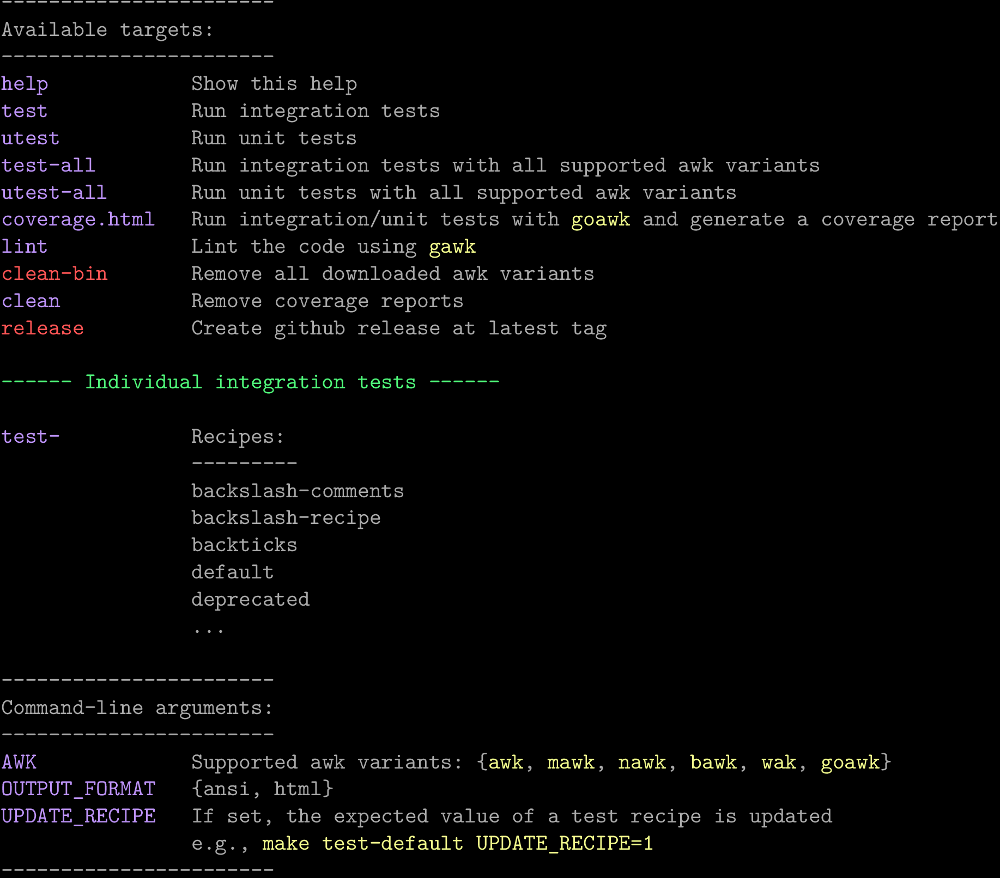

# Documenting Makefiles

After having spent years documenting my `Makefile`s using (a variation of)
 [this](https://gist.github.com/prwhite/8168133) `awk` one-liner, I decided to factor
 things out in a library [makefile-doc](https://github.com/drdv/makefile-doc). This
 turned out to be a nice small project with `awk`. The following is a short overview.

<!-- more -->

As an example, consider the documentation of the
[`Makefile`](https://github.com/drdv/makefile-doc/blob/670fd3f5ebeec70b61bd492504d27cb2a255945f/Makefile)
(at tag `v1.4`) of [makefile-doc](https://github.com/drdv/makefile-doc):

<div>
--8<-- "blog/202511-makefile-doc/examples/makefile-doc-help.html"
</div>

I find it useful to document both targets and variables. This can be done using `##`,
`##!` and `##%` placed either above them or inline[^1]. The syntax is:

```Makefile
##% A variable
VAR := 1

## Top-level docs take precedense
## and could stretch over multiple lines
t1: ## This is not shown

##@ This defines a section

t2: ##! This is the doc for t2
```

Explicitly listing (in an automated way) the possible values for command-line arguments
is helpful. For example, currently there are 6 supported variants of awk as can be seen
from the documentation of the command-line argument `AWK`. In a simmilar manner one can
see how individual tests can be run, using `make test-` followed by a particular recipe
(the number of entries and their formatting can be specified using several parameters).


To use `makefile-doc`, simply place the following at the top of your `Makefile` (for
more details see the project
[README](https://github.com/drdv/makefile-doc?tab=readme-ov-file#awk-script-for-makefile-docs)):

```Makefile
help: URL := github.com/drdv/makefile-doc/releases/latest/download/makefile-doc.awk
help: DIR := $(HOME)/.local/share/makefile-doc
help: SCR := $(DIR)/makefile-doc.awk
help: ## show this help
	@test -f $(SCR) || wget -q -P $(DIR) $(URL)
	@awk $(VFLAGS) -f $(SCR) $(MAKEFILE_LIST)
```

The variable `VFLAGS` can be left empty or can be used to pass options to the
`makefile-doc.awk` script via the standard `-v OPTION=VALUE` flag of `awk`. This is
pretty much it, the rest is exploring some of the options and finding what works for
you. As an example, the project's `Makefile` uses the following options:

```Makefile
help: VFLAGS := \
	-v SUB='$(TESTS_SUB);$(AWK_SUB)' \
	-v EXPORT_THEME=$(EXPORT_THEME) \
	-v COLOR_BACKTICKS=33 \
	-v OUTPUT_FORMAT=$(OUTPUT_FORMAT)`
```

The above HTML docs have been generated using `make OUTPUT_FORMAT=HTML` (output to Latex
is supported as well).

## Substitutions

The `SUB` option specifies substitutions and value formatting.
For example, the listing of the supported `awk` variants is generated using

```
AWK_SUB := <L:0,M:0,I:{,T:},S:\\,>AWK:$(SUPPORTED_AWK_VARIANTS)
```

The actual values come from the variable `$(SUPPORTED_AWK_VARIANTS)`, while the
following parameters control the formatting:

+ `L:0` - list the values starting from the current line
+ `M:0` - list the values on a single line (as opposed to `M:1` for multi-line listing)
+ `I:{` and `T:}` define the initial and terminal delimiters
+ `S:\\,` is the separator (note that the comma has to be escaped).

The format of a substitution is `[<p1:v1,...>]NAME[:LABEL]:[VALUES]`. For the above
example we have:

+ `[<p1:v1,...>]` :octicons-arrow-right-16: `<L:0,M:0,I:{,T:},S:\\,>`
+ `NAME` :octicons-arrow-right-16: `AWK`
+ `[VALUES]` :octicons-arrow-right-16: `$(SUPPORTED_AWK_VARIANTS)`.

Only the optional `[:LABEL]` is omitted. It is normally used to rename targets specified
in terms of variables -- as is the case with the individual test targets above (where
`[:LABEL]`:octicons-arrow-right-16: `test-` because the actual target name is
`$(TESTS):` and it is not very informative at the level of the documentation).

## Theme

The default
[Solarized](https://github.com/altercation/solarized?tab=readme-ov-file#the-values)
theme can be easily customised. Below is an example of the same Makefile but using the
[Dracula](https://github.com/dracula/dracula-theme?tab=readme-ov-file#color-palette)
theme and exported to png[^2]. Unlike the HTML version above (where the background is
left to be transparent), here we have set a black background. A "standalone" image is
generated for convenient use in presentations.



[^1]: The meaning of the three tokens is entirely up to you.
[^2]: This is done by specifying the `EXPORT_THEME` option (see the project
    [README](https://github.com/drdv/makefile-doc?tab=readme-ov-file#export-to-html-and-latex).)
