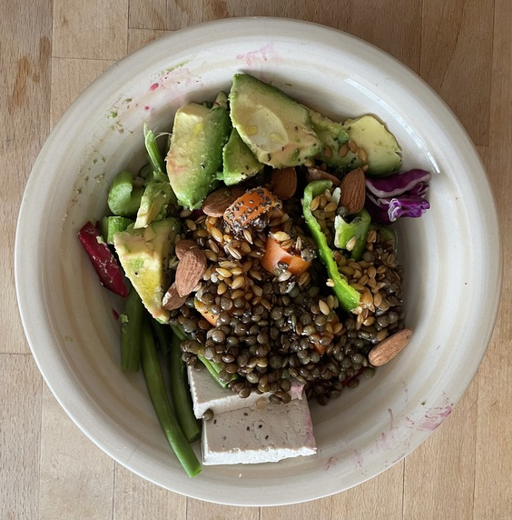
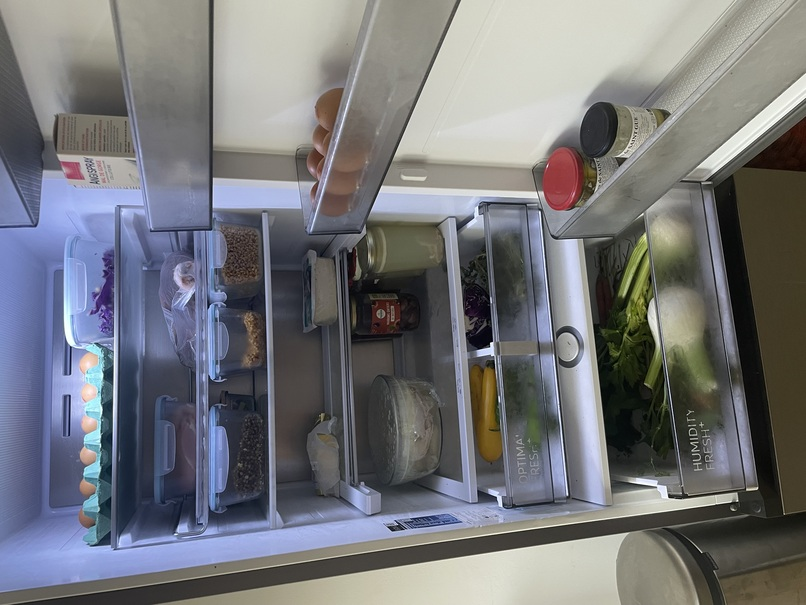
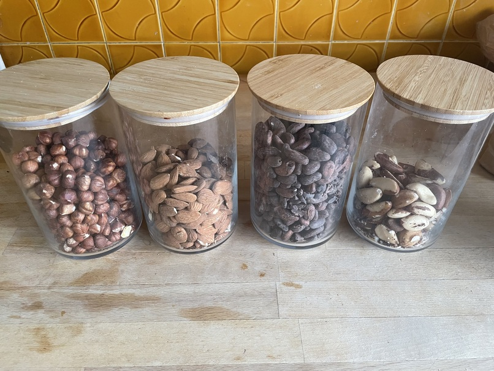
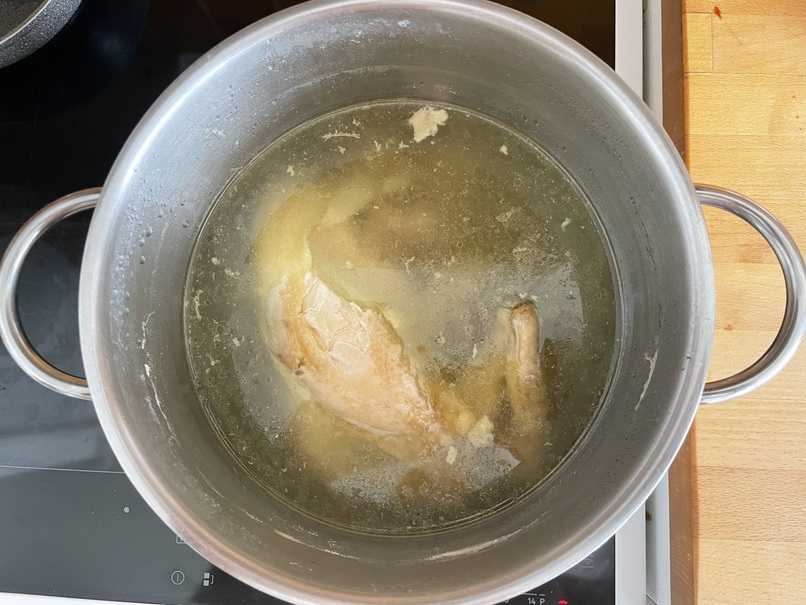
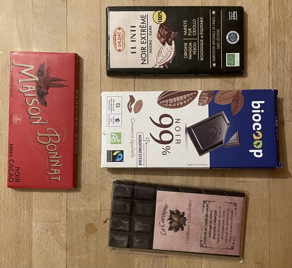

# Tracking my food for a month

This August, out of curiosity, I decided to monitor my food intake for a month. So I
bought myself a kitchen scale, a friend lent me a few measuring spoons, and I started
keeping records. The idea was to make no notable changes in what I eat so that I could
identify useful patterns. Among other things, I was hoping that this would help me
reduce unnecessary expenses. As with most of my projects, I relied on [ledger
cli](https://ledger-cli.org/) for the bookkeeping part.

<!-- more -->

## The data

I decided to not log water and tea consumption (normally I don't drink anything else).
Certain ingredients are not simple to measure accurately. Some spices come to mind, but
mostly I had troubles with things like parsley, spinach, lettuce, beet greens etc. (as I
tend to mix them), so I ended up using a single category -- "leafy greens". The data
doesn't contain details about the cooking process even though I have my particularities
(e.g., I tend to eat my vegetables raw for lunch and steamed for dinner)[^1]. The
end-result is [this](../202512-tracking-food/data.ledger) ledger file (which I use to
generate the summary data below). Note that the time of each record indicates meal start
(normally it took me around half an hour to finish) and some ingredients are counted by
piece e.g., eggs, apples, plums[^2].

## Ingredients

The "[garbage in, garbage out](https://en.wikipedia.org/wiki/Garbage_in,_garbage_out)"
principle from computer science applies here directly. No amount of cooking trickery can
undo the damage present at the source! So, I give a few examples of what the "numbers"
in the data actually represent. To begin with, here is a typical lunch menu and what my
fridge looks like when stocked.

<div class="grid" markdown>


/// figure-caption
An example dish I usually have for lunch
///


/// figure-caption
My fridge when stocked
///

</div>

### The backbone of my regime

I consider the backbone of my diet to be **grains** (einkorn, wheat), **legumes**
(lentils, chickpea) and **nuts** (walnuts, almonds, hazelnuts, etc). All three are, more
or less, constantly present on my table through the year. The rest of the ingredients
vary considerably from season to season and depending on the type of sports activities I
do[^3]. This can be seen clearly in the data -- I was fairly surprised to see that, at a
normal pace, I consume around 4kg of nuts per month:

```
--8<-- "blog/202512-tracking-food/out/bal-backbone"
```

Walnuts are the "key player" due to the fact that I like them a lot and there are many
high-quality producers around Grenoble[^4] (I always buy shelled walnuts and crack them
open when I eat, I have almost transitioned to doing the same with hazelnuts as well).
Cocoa beans are an exception in this context. This year I couldn't find good quality raw
ones and I bought them roasted (it turned out that, when roasted, they are more
digestible and develop a richer, more pronounced flavor).

<div class="grid" markdown>

/// figure-caption
Nuts, ready to use
///
</div>

A note on einkorn: this is the grain I have experimented with the most over the years.
By "einkorn" here I mean "littlespelt" i.e., "petit épeautre" in French or "лимец" in
Bulgarian. Normally I soak the grain in water between 2 to 24 hours (depending on how I
want to prepare it). Then I can eat it directly, let it sprout or heat to a boil, then
immediately cool (the latter option is what I do most of the time). It preserves very
well in a fridge (unlike chickpea) and pairs nicely with almost anything else I eat.
This last point is the reason I have reduced my bread consumption a lot the past few
years (I almost never buy nowadays and prepare it myself -- more on this later).

Having lived in Japan, I really like natto. Unfortunately, here I haven't been able to
find good one at a reasonable price (as with everything else in life, I have to learn to
prepare it myself -- I guess this would be one of my next food related projects).

### The 5 colors principle

My first reaction when I heard it 10 years ago was "who cares about colors"! I guess I
should write a post named "Teach Yourself to Eat in Ten Years" following the famous
[Teach Yourself Programming in Ten Years](https://www.norvig.com/21-days.html) (whose
point is spot on). Most of the colors in my food came from the following veggies:

```
--8<-- "blog/202512-tracking-food/out/bal-vegetables"
```

Peppers, carrots and beetroot are the usual suspects. I remember my reaction when I
found a local producer of Cubanelle peppers that taste just like what I could harvest
from my grandmother's garden[^5]! Most veggies in my plate don't have only an associated
color, they have an associated name as well -- the name of the person that produced
them. It is so important to see and talk to the people that have chosen this path ... to
look at their hands, they speak volumes! Luckily, here in Grenoble this happens quite
naturally.

I remember when I was in my 20s, I had a girlfriend that invited me at her grandmother's
place and they had prepared beetroot (I think it was boiled). I thought the taste was so
awful that I felt unwelcome. Over the years I have tried many different recipes and the
result was always the same -- I didn't like it. Until one day I tried it raw and this
changed my perspective (something really clicked). Now I always eat my beetroot raw --
just peel the skin and cut it in slices (it seems to me that anything else is simply a
waste of high-quality food). To my surprise, my kids like it as well.

### Proteins

Protein intake is a controversial topic (partly because its impact on my life depends
heavily on the kind of life I'm living). I have experimented with various regimes over
the years, including completely removing meat from my diet (for two years). What I have
learned in the process is that I should listen to my body. To give context, during the
period of my food-tracking experiment I was very active. I walked on average 16km per
day, which is considerably less than what I did during my [summer walking
challenge](202411-summer-walking-challenge.md) from last year, but I complemented it
with quite intense strength training four times a week (among other things, most
sessions included four series of 9 correctly executed pull-ups). So I had to pay special
attention to my protein intake. Here are the ingredients:

```
--8<-- "blog/202512-tracking-food/out/bal-proteins"
```

<div class="grid" markdown>


/// figure-caption
Boiled chicken
///


/// figure-caption
Boiled chicken stored in the fridge
///

</div>

I tend to buy a mature hen (that has actually seen the light of day) and boil it for
three and a half or four hours (without added spices). The result is displayed above
(when boiled and when stored in the fridge afterwards). The "Chicken bouillon" in the
balance comes from here and I normally have to store some of it in jars (see the first
shelf of my fridge). The meat might end-up being a bit tough (well, if the kids don't
complain, I guess its just fine) but the bouillon is special[^6]!. In addition, I like
preparing whole turkey leg in a convection oven (again no spices, 180&deg;C for a bit
less than two hours) -- the meat is lean, just fantastic.

And then comes **my** Bulgarian yogurt. I say "my" because I prepare it myself -- this
is an entire ritual, I have found a very good quality milk[^7]. I started doing this
only a year ago but I think that my understanding is close to being mature (I intend to
write a dedicated post). Most yogurt I ate during my experiment was from cow's milk:


/// figure-caption
My yogurt
///

My weekly eggs consumption was:

```
--8<-- "blog/202512-tracking-food/out/reg-eggs"
```

### Carbs

I am not a heavy carbs eater and probably that's why when I do eat, I really feel them
(especially if I have to do intense physical effort afterwards).

```
--8<-- "blog/202512-tracking-food/out/bal-carbs"
```

I guess, the things I eat are mostly standard. As the pumpkin season was not in
full-swing I didn't eat as much as I normally do during the winter. We are quite lucky
here in Grenoble -- we have a great variety and excellent local producers of pumpkins.
Same for chestnuts (by the way, this winter I tried for the first time chestnuts from a
producer in Ardèche -- the guy was so passionate about his crops -- great stuff).

The one thing probably worth mentioning is my bread (I experiment quite a bit and tend
to mix different flours). The image below is of a typical flour I use[^8] -- made by one
of the remarkable local producers (from him I usually buy excellent beetroot and
strawberries as well):


/// figure-caption
Flour that smells like home!
///

I prepare dough only from flour and water -- it doesn't need much kneading. I make only
small portions and if I am in a hurry I grill them almost like naan bread, or if I have
some time I bake them in the oven. nothing fancy. I have invented the following desert:
I wrap the dough around walnuts and dried dates (cut in pieces), and bake for half an
hour (it is naturally sweet and so damn delicious).

### Fruits

```
--8<-- "blog/202512-tracking-food/out/bal-fruits"
```

Dates are my "fried in need". I think that I can easily determined how stressed I am by
how many dates I eat (there is a clear correlation). I eat them mostly with my breakfast
and before I exercise. During the experiment I didn't feel like eating a lot of fruits
with one exception -- figs. They are quite expensive and I have no idea why but in the
shops around here the quality is bad. So I end up "hunting" for figs and on a good day I
am reminded that there is a hungry pig in me somewhere (I was quite lucky this year,
there were many good trees and not many people caring to eat from them).


### Misc

The data contains several other categories like seeds, spices, fats, algae. Here I want
to mention chocolate (probably I should call it cocoa paste). I like it a lot and I eat
even though I already eat cocoa beans. There is a slightly bitter taste that goes very
well with walnuts (and dates).

```
--8<-- "blog/202512-tracking-food/out/bal-fats"
```

Here are several examples


/// figure-caption
Dark chocolate (100% cocoa)
///

## A parting thought

The process of monitoring oneself is revealing at many levels. The fact that I was in
this frame of mind lead to many valuable discussions with friends that helped me to
understand much about my food and in turn about myself. I am curious to see what would I
think of this post in five years time ...

!!! note "Comments"

    Got feedback? Leave it [here](https://github.com/drdv/drdv.github.io/discussions/2).

[^1]: However, normally, when I say "I am cooking" I really mean "I am assembling
    ingredients".

[^2]: This is much more intuitive to me and, anyway, I am not interested in counting
    calories or tracking macronutrients.

[^3]: For example, I tend to eat quite a bit of lean meat and eggs during periods of
    intense physical activity (I have convinced myself experimentally that this makes a
    big difference in my case).

[^4]: Usually, in October it is possible to simply go and gather some. For example,
    after my food tracking experiment was over, in October I went with my daughter to
    Tulins (which is half an hour away by train) and we gathered 8kg of walnuts from the
    ground.

[^5]: I have a memory: once I saw how my dog sneaked into the garden, picked a pepper,
    and sat down, carefully nibbling it between her front paws (it was so weird).

[^6]: When I was a kid I should have appreciated more when my grandmother was making
    soup from our own chicken (it felt so standard and unimportant at the time).

[^7]: I had a long discussion with a friend whether one should say "raw milk" to
    indicate the milk straight from the cow/sheep/goat. I refuse to accept that we need
    to add the term raw -- milk is milk, everything else requires a qualifier.

[^8]: Even though this particular pack was bought after the experiment was over.
